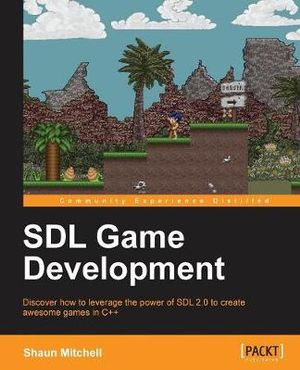

# SDL Game Development Tutorials
Working through *SDL Game Development* by *Shaun Mitchell* tutorials/chapters to learn more about the SDL2 library and also developing my C++ skills.



## Dependencies
Theses are all of the dependencies for all of the chapters:
* SDL2 

### Ubuntu/Debian
SDL2:
```
sudo apt install libsdl2-dev
```

## Make